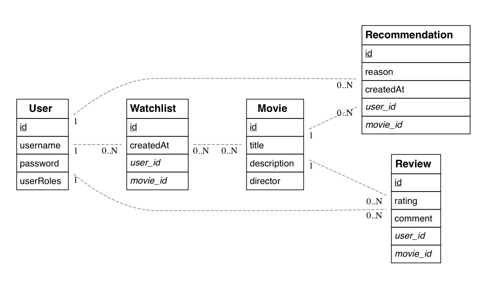

# Dossier

- Student: Jari Vancauwenberghe
- Studentennummer: 221003505575
- E-mailadres: <mailto:jari.vancauwenberghe@student.hogent.be>
- Demo: <https://webservices-jarivancauwenberghe.onrender.com>
- GitHub-repository: <https://github.com/HOGENT-frontendweb/frontendweb-2425-jarivancauwenberghe.git>
- Web Services:
  - Online versie: <https://webservices-jarivancauwenberghe.onrender.com>

## Logingegevens

### Lokaal

- Gebruikersnaam/e-mailadres: user1
- Wachtwoord: password1

### Online

- Gebruikersnaam/e-mailadres: user1
- Wachtwoord: password1

## Projectbeschrijving

Dit project betreft een **Movie Review API** waarmee gebruikers in staat zijn om films te ontdekken, hun recensies te delen en de meningen van anderen te bekijken. De applicatie biedt een gestructureerde manier om met films, gebruikers, recensies, aanbevelingen en watchlists om te gaan, met volledige CRUD-functionaliteit (Create, Read, Update, Delete). Het project is opgebouwd met **TypeScript**, **Node.js**, **Express** en **TypeORM** en is ontwikkeld om schaalbaar en onderhoudbaar te zijn.

### Domeinmodel (ERD)

Het domeinmodel bestaat uit vijf hoofdelementen:

- **Gebruikers**: Bevat alle gegevens m.b.t. gebruikers, zoals inloggegevens en rollen (admin/user).
- **Films**: Beschrijving, titel, regisseur.
- **Recensies**: Beoordelingen van gebruikers over specifieke films.
- **Aanbevelingen**: Films die door gebruikers worden aanbevolen.
- **Watchlists**: Films die gebruikers willen bekijken.

## API calls

### Gebruikers

- `GET /api/users`: alle gebruikers ophalen
- `GET /api/users/:id`: gebruiker met een bepaald id ophalen
- `POST /api/users`: een nieuwe gebruiker aanmaken
- `PUT /api/users/:id`: een bestaande gebruiker updaten
- `DELETE /api/users/:id`: een gebruiker verwijderen

### Films

- `GET /api/movies`: alle films ophalen
- `GET /api/movies/:id`: film met een bepaald id ophalen
- `POST /api/movies`: een nieuwe film toevoegen
- `PUT /api/movies/:id`: een bestaande film updaten
- `DELETE /api/movies/:id`: een film verwijderen

### Recensies

- `GET /api/reviews`: alle recensies ophalen
- `GET /api/reviews/:id`: recensie met een bepaald id ophalen
- `POST /api/reviews`: een nieuwe recensie toevoegen
- `PUT /api/reviews/:id`: een bestaande recensie updaten
- `DELETE /api/reviews/:id`: een recensie verwijderen

### Aanbevelingen

- `GET /api/recommendations`: alle aanbevelingen ophalen
- `GET /api/recommendations/:id`: aanbeveling met een bepaald id ophalen
- `POST /api/recommendations`: een nieuwe aanbeveling toevoegen
- `PUT /api/recommendations/:id`: een bestaande aanbeveling updaten
- `DELETE /api/recommendations/:id`: een aanbeveling verwijderen

### Watchlists

- `GET /api/watchlists`: alle watchlists ophalen
- `GET /api/watchlists/:id`: watchlist met een bepaald id ophalen
- `POST /api/watchlists`: een nieuwe watchlist toevoegen
- `PUT /api/watchlists/:id`: een bestaande watchlist updaten
- `DELETE /api/watchlists/:id`: een watchlist verwijderen

## Behaalde minimumvereisten

### Datalaag

- [x] voldoende complex en correct (meer dan één tabel (naast de user tabel), tabellen bevatten meerdere kolommen, 2 een-op-veel of veel-op-veel relaties)
- [x] één module beheert de connectie + connectie wordt gesloten bij sluiten server
- [x] heeft migraties - indien van toepassing
- [x] heeft seeds

#### Repositorylaag

- [x] definieert één repository per entiteit - indien van toepassing
- [x] mapt OO-rijke data naar relationele tabellen en vice versa - indien van toepassing
- [x] er worden kindrelaties opgevraagd (m.b.v. JOINs) - indien van toepassing

#### Servicelaag met een zekere complexiteit

- [x] bevat alle domeinlogica
- [x] er wordt gerelateerde data uit meerdere tabellen opgevraagd
- [x] bevat geen services voor entiteiten die geen zin hebben zonder hun ouder (bv. tussentabellen)
- [x] bevat geen SQL-queries of databank-gerelateerde code

#### REST-laag

- [x] meerdere routes met invoervalidatie
- [x] meerdere entiteiten met alle CRUD-operaties
- [x] degelijke foutboodschappen
- [x] volgt de conventies van een RESTful API
- [x] bevat geen domeinlogica
- [x] geen API calls voor entiteiten die geen zin hebben zonder hun ouder (bv. tussentabellen)
- [x] degelijke autorisatie/authenticatie op alle routes

#### Algemeen

- [x] er is een minimum aan logging en configuratie voorzien
- [x] een aantal niet-triviale én werkende integratietesten (min. 1 entiteit in REST-laag >= 90% coverage, naast de user testen)
- [x] node_modules, .env, productiecredentials... werden niet gepushed op GitHub
- [x] minstens één extra technologie die we niet gezien hebben in de les
- [x] maakt gebruik van de laatste ES-features (async/await, object destructuring, spread operator...)
- [x] de applicatie start zonder problemen op gebruikmakend van de instructies in de README
- [x] de API draait online
- [x] duidelijke en volledige README.md
- [x] er werden voldoende (kleine) commits gemaakt
- [x] volledig en tijdig ingediend dossier

## Projectstructuur

### Web Services

De projectstructuur is zo opgezet dat deze de verschillende verantwoordelijkheden scheidt, wat de onderhoudbaarheid en schaalbaarheid van de applicatie ten goede komt.

- **config**: Omgevingsspecifieke instellingen.
- **src**: Bevat alle bronbestanden van de applicatie.
  - **core**: Kernfunctionaliteit (auth, logging, error handling).
  - **data**: Database initialisatie.
  - **entity**: Entiteiten voor TypeORM.
  - **dto**: Data Transfer Objects voor type-safe data-uitwisseling.
  - **rest**: Controllers en routers voor de API.
  - **services**: Services met domeinlogica.
  - **tests**: Hier bevinden zich de testbestanden voor het project.

### Design Patterns

- Repository Pattern (TypeORM)
- Service Pattern (controllers roepen services aan)
- Middleware Pattern (auth, error handling)
- DTO Pattern (scheiding logica van input/output)
  
## Extra technologie

- **Express**: Een minimalistisch webapplicatie framework voor Node.js dat robuuste functies biedt voor het ontwikkelen van web- en mobiele applicaties.
  - [Express npm package](https://www.npmjs.com/package/express)
- **TypeORM**: Een krachtige Object-Relational Mapping (ORM) tool voor TypeScript en JavaScript, die zowel Active Record als Data Mapper patronen ondersteunt.
  - [TypeORM npm package](https://www.npmjs.com/package/typeorm)
- **Class-validator**: Biedt decorators voor validatie van objecten in TypeScript en JavaScript.
  - [Class-validator npm package](https://www.npmjs.com/package/class-validator)
- **Winston**: Een flexibele en veelzijdige logger voor Node.js.
  - [Winston npm package](https://www.npmjs.com/package/winston)

## Gekende bugs

Er zijn momenteel geen bekende bugs.

## Reflectie

Dit project heeft me geholpen om inzicht te krijgen in het ontwerpen en ontwikkelen van een schaalbare en onderhoudbare webapplicatie. Ik heb veel geleerd over het implementeren van design patterns, het gebruik van TypeScript en het opzetten van een REST API met complexe relaties. In de toekomst zou ik meer tijd willen besteden aan het verfijnen van mijn tests en het documenteren van mijn code.

Volgend semester zal ik mijn bachelorproef doen over "Ontwikkeling van een Application Programming Interface (API) voor Dynamische Data Selectie en Aggregatie van Wearable Sensor Data." Ik kijk ernaar uit om de kennis en vaardigheden die ik in dit vak heb opgedaan, er in toe te passen.
